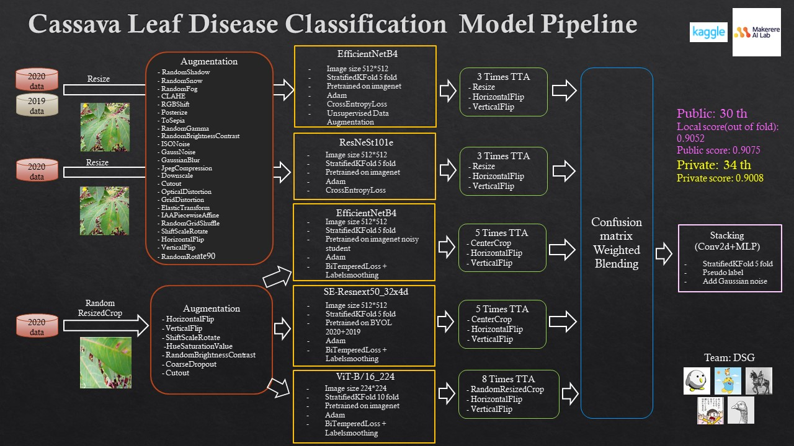
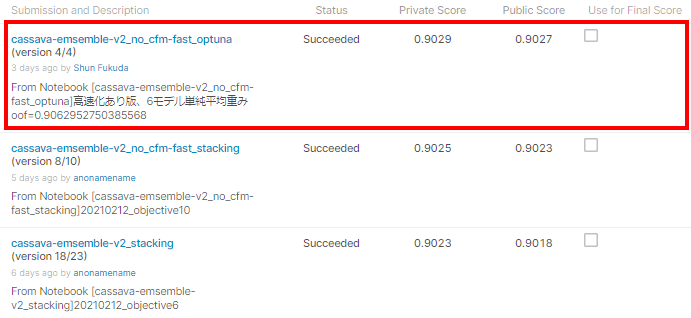

# kaggle キャッサバコンペのコード
- https://www.kaggle.com/c/cassava-leaf-disease-classification

## コンペ概要
- 2020年11月20日〜2021年2月19日に渡って開催
- キャッサバの葉の病気の種類を分類
    - キャッサバの植物病害を迅速に特定することで、作物の収量を増やすのに役立つ（キャッサバのイモは一時期ブームになったタピオカの原料）
- 特徴量は画像
    - train set: 21,367枚, test set: 約15,000枚
- マルチクラス分類問題
    - 5クラス（病気4種類、健康1種）

        - キャッサバの病害の解説
            - https://www.kaggle.com/c/cassava-leaf-disease-classification/discussion/198143
                - CBB：角ばった斑点、黄色の縁取りのある茶色の斑点、黄色の葉、葉がしおれていく
                - CBSD：黄色斑点
                - CGM：黄色の模様、黄色と緑の不規則な斑点、葉縁の歪み、発育不良
                - CMD：重度の形状歪曲、モザイク模様
                - Healthy：その他
- 評価指標はAccuracy
- コードコンペ
    - kaggle notebookで予測実行してsubmission.csvをサブミットする
- ラベル不均衡あり
    - https://www.kaggle.com/c/cassava-leaf-disease-classification/discussion/202651
- ラベルノイズ多い
    - https://www.kaggle.com/c/cassava-leaf-disease-classification/discussion/202673
    - 専門家がラベル付けしたみたいだが、間違ったラベル多い模様
        - https://www.kaggle.com/c/cassava-leaf-disease-classification/overview
- 2019年に同様のコンペ開催されており、2019年のデータ利用可能
    - https://www.kaggle.com/c/cassava-disease/data
    - 2019年のコンペの論文: https://arxiv.org/abs/1908.02900

## 結果

34位

bestなモデル選べてたら金圏だった。cv/LB どちらもbestなサブではないから選ぶのは不可能だったが。

## zennのコンペ振り返り記事: 

https://zenn.dev/anonamename/articles/2fc40af8f165b6

## wandbの実験履歴

https://wandb.ai/anonamename/kaggle_cassava